* Table of Contents
{:toc}

--------------------------------------------------------------------------------------------------------------------

## **Acknowledgements**

* {list here sources of all reused/adapted ideas, code, documentation, and third-party libraries -- include links to the original source as well}

--------------------------------------------------------------------------------------------------------------------

## **Setting up, getting started**

Refer to the guide [_Setting up and getting started_](SettingUp.md).

--------------------------------------------------------------------------------------------------------------------

## **Design**

:bulb: **Tip:** The `.puml` files used to create diagrams are in this document `docs/diagrams` folder. Refer to the [_PlantUML Tutorial_ at se-edu/guides](https://se-education.org/guides/tutorials/plantUml.html) to learn how to create and edit diagrams.

### Architecture

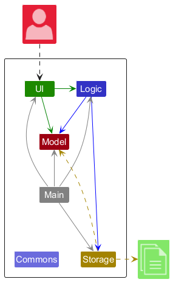

The ***Architecture Diagram*** given above explains the high-level design of the App.

Given below is a quick overview of main components and how they interact with each other.

**Main components of the architecture**

**`Main`** (consisting of classes [`Main`](https://github.com/se-edu/addressbook-level3/tree/master/src/main/java/seedu/address/Main.java) and [`MainApp`](https://github.com/se-edu/addressbook-level3/tree/master/src/main/java/seedu/address/MainApp.java)) is in charge of the app launch and shut down.
* At app launch, it initializes the other components in the correct sequence, and connects them up with each other.
* At shut down, it shuts down the other components and invokes cleanup methods where necessary.

The bulk of the app's work is done by the following four components:

* [**`UI`**](#ui-component): The UI of the App.
* [**`Logic`**](#logic-component): The command executor.
* [**`Model`**](#model-component): Holds the data of the App in memory.
* [**`Storage`**](#storage-component): Reads data from, and writes data to, the hard disk.

[**`Commons`**](#common-classes) represents a collection of classes used by multiple other components.

**How the architecture components interact with each other**

The *Sequence Diagram* below shows how the components interact with each other for the scenario where the user issues the command `delete 1`.

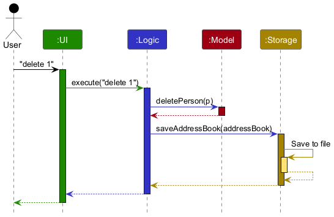

Each of the four main components (also shown in the diagram above),

* defines its *API* in an `interface` with the same name as the Component.
* implements its functionality using a concrete `{Component Name}Manager` class (which follows the corresponding API `interface` mentioned in the previous point.

For example, the `Logic` component defines its API in the `Logic.java` interface and implements its functionality using the `LogicManager.java` class which follows the `Logic` interface. Other components interact with a given component through its interface rather than the concrete class (reason: to prevent outside component's being coupled to the implementation of a component), as illustrated in the (partial) class diagram below.

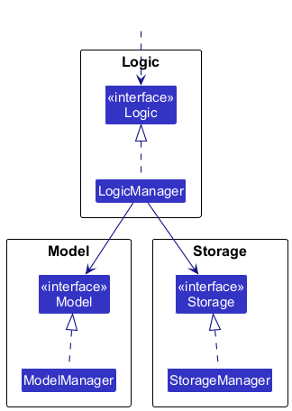

The sections below give more details of each component.

### UI component

The **API** of this component is specified in [`Ui.java`](https://github.com/se-edu/addressbook-level3/tree/master/src/main/java/seedu/address/ui/Ui.java)

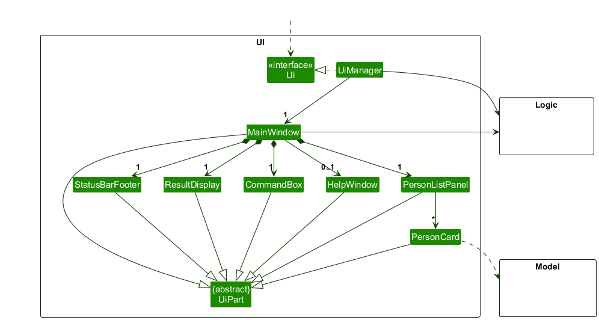

The UI consists of a `MainWindow` that is made up of parts e.g.`CommandBox`, `ResultDisplay`, `PersonListPanel`, `StatusBarFooter` etc. All these, including the `MainWindow`, inherit from the abstract `UiPart` class which captures the commonalities between classes that represent parts of the visible GUI.

The `UI` component uses the JavaFx UI framework. The layout of these UI parts are defined in matching `.fxml` files that are in the `src/main/resources/view` folder. For example, the layout of the [`MainWindow`](https://github.com/se-edu/addressbook-level3/tree/master/src/main/java/seedu/address/ui/MainWindow.java) is specified in [`MainWindow.fxml`](https://github.com/se-edu/addressbook-level3/tree/master/src/main/resources/view/MainWindow.fxml)

Compared with the base AB3 layout, IOU's `MainWindow` uses a split view: the left side shows the person list and the right side shows a dedicated `TransactionListPanel` for the currently selected person. Selecting a person in `PersonListPanel` triggers `TransactionListPanel` to re-render that person's transactions. Commands that mutate only transactions can also request an explicit panel refresh through `CommandResult` so the transaction table stays in sync even when the selection itself does not change.

The `UI` component,

* executes user commands using the `Logic` component.
* listens for changes to `Model` data so that the UI can be updated with the modified data.
* keeps a reference to the `Logic` component, because the `UI` relies on the `Logic` to execute commands.
* depends on some classes in the `Model` component, as it displays `Person` objects and their associated `Transaction` objects.

### Logic component

**API** : [`Logic.java`](https://github.com/se-edu/addressbook-level3/tree/master/src/main/java/seedu/address/logic/Logic.java)

Here's a (partial) class diagram of the `Logic` component:

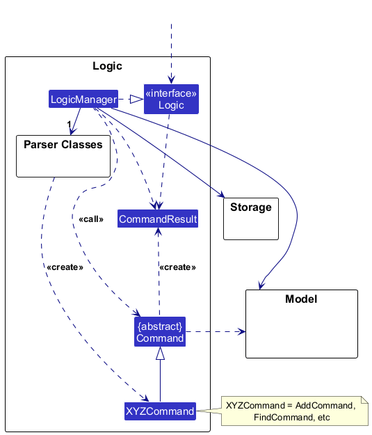

The sequence diagram below illustrates the interactions within the `Logic` component, taking `execute("delete 1")` API call as an example.

:information_source: **Note:** The lifeline for `DeleteCommandParser` should end at the destroy marker (X) but due to a limitation of PlantUML, the lifeline continues till the end of diagram.

How the `Logic` component works:

1. When `Logic` is called upon to execute a command, it is passed to an `AddressBookParser` object which in turn creates a parser that matches the command (e.g., `DeleteCommandParser`) and uses it to parse the command.
1. This results in a `Command` object (more precisely, an object of one of its subclasses e.g., `DeleteCommand`) which is executed by the `LogicManager`.
1. The command can communicate with the `Model` when it is executed (e.g. to delete a person). 
   Note that although this is shown as a single step in the diagram above (for simplicity), in the code it can take several interactions (between the command object and the `Model`) to achieve.
1. The result of the command execution is encapsulated as a `CommandResult` object which is returned back from `Logic`.

Here are the other classes in `Logic` (omitted from the class diagram above) that are used for parsing a user command:

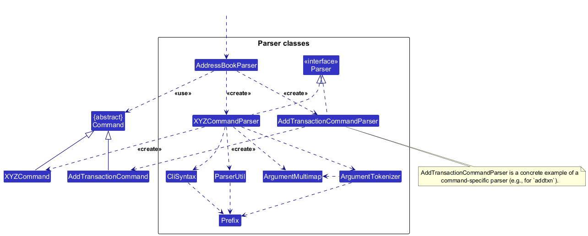

How the parsing works:
* When called upon to parse a user command, the `AddressBookParser` class creates an `XYZCommandParser` (`XYZ` is a placeholder for the specific command name e.g., `AddCommandParser`) which uses the other classes shown above to parse the user command and create a `XYZCommand` object (e.g., `AddCommand`) which the `AddressBookParser` returns back as a `Command` object.
* All `XYZCommandParser` classes (e.g., `AddCommandParser`, `DeleteCommandParser`, ...) inherit from the `Parser` interface so that they can be treated similarly where possible e.g, during testing.

### Model component
**API** : [`Model.java`](https://github.com/se-edu/addressbook-level3/tree/master/src/main/java/seedu/address/model/Model.java)

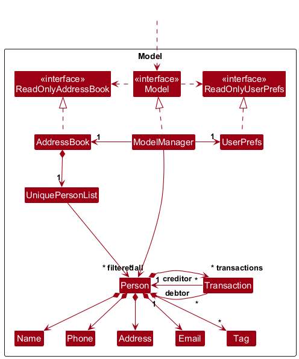

The `Model` component,

* stores the address book data i.e., all `Person` objects (which are contained in a `UniquePersonList` object).
* stores each person's transactions inside the `Person` object as a `Set<Transaction>`.
* treats a transaction as a shared domain object referenced by both the debtor and the creditor, so UI and commands view the same record from either person's perspective.
* stores the currently 'selected' `Person` objects (e.g., results of a search query) as a separate _filtered_ list which is exposed to outsiders as an unmodifiable `ObservableList<Person>` that can be 'observed' e.g. the UI can be bound to this list so that the UI automatically updates when the data in the list change.
* stores a `UserPref` object that represents the user’s preferences. This is exposed to the outside as a `ReadOnlyUserPref` objects.
* does not depend on any of the other three components (as the `Model` represents data entities of the domain, they should make sense on their own without depending on other components)

To avoid recursive equality and hash-code issues between `Person` and `Transaction`, `Person.equals()` and `Person.hashCode()` intentionally exclude transactions. This allows transactions to safely keep references to `Person` objects while still being stored in sets and rebound after edits or deserialisation.

:information_source: **Note:** An alternative (arguably, a more OOP) model is given below. It has a `Tag` list in the `AddressBook`, which `Person` references. This allows `AddressBook` to only require one `Tag` object per unique tag, instead of each `Person` needing their own `Tag` objects. 

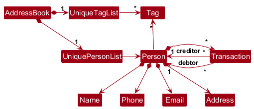

### Storage component

**API** : [`Storage.java`](https://github.com/se-edu/addressbook-level3/tree/master/src/main/java/seedu/address/storage/Storage.java)

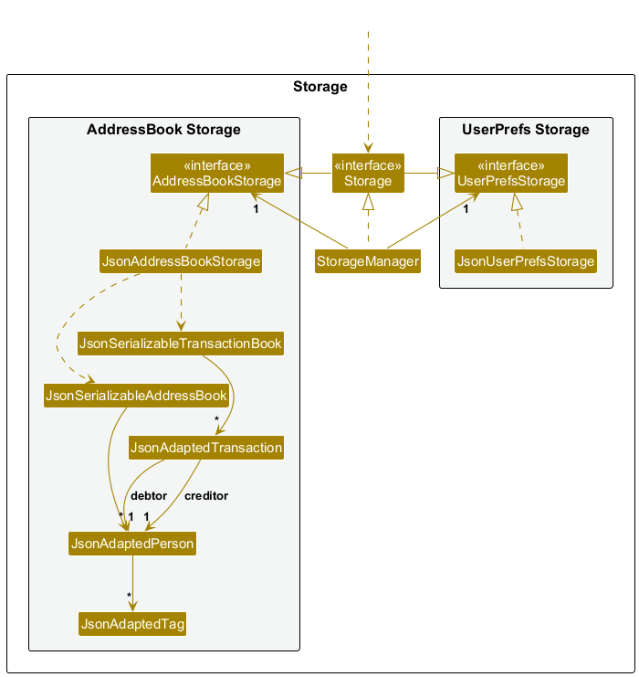

The `Storage` component,
* can save both address book data and user preference data in JSON format, and read them back into corresponding objects.
* persists persons and transactions into separate files: the main address book file stores persons, while a sibling file with `_transactions` appended before the extension stores transactions.
* loads persons first, then loads transactions and rebinds each transaction's debtor and creditor to the live `Person` instances already present in the in-memory model.
* inherits from both `AddressBookStorage` and `UserPrefStorage`, which means it can be treated as either one (if only the functionality of only one is needed).
* depends on some classes in the `Model` component (because the `Storage` component's job is to save/retrieve objects that belong to the `Model`)

### Common classes

Classes used by multiple components are in the `seedu.address.commons` package.

--------------------------------------------------------------------------------------------------------------------

## **Implementation**

This section describes some noteworthy details on how certain features are implemented.

### Transaction management

IOU extends AB3 with a transaction subsystem built around three ideas.

1. `AddTransactionCommandParser` parses two person indexes plus a `TransactionDescriptor`, then `AddTransactionCommand` resolves the live debtor and creditor from the filtered person list.
1. The same `Transaction` object is appended to both involved persons. This keeps the debtor and creditor views consistent and allows commands such as `settle` and transaction-scoped `delete` to update one shared record.
1. The transaction panel and transaction-targeting commands use the same displayed order: transactions are sorted by current amount in descending order before being assigned a one-based transaction index.

When a person is edited, `EditCommand` creates a replacement `Person` object and rewires every transaction that previously referenced the old person to reference the new one instead. This preserves transaction history while still allowing person details such as name, phone, or tags to change.

At startup, IOU also ensures there is always a `Me` contact at the front of the address book if one does not already exist.

### \[Proposed\] Undo/redo feature

#### Proposed Implementation

The proposed undo/redo mechanism is facilitated by `VersionedAddressBook`. It extends `AddressBook` with an undo/redo history, stored internally as an `addressBookStateList` and `currentStatePointer`. Additionally, it implements the following operations:

* `VersionedAddressBook#commit()` — Saves the current address book state in its history.
* `VersionedAddressBook#undo()` — Restores the previous address book state from its history.
* `VersionedAddressBook#redo()` — Restores a previously undone address book state from its history.

These operations are exposed in the `Model` interface as `Model#commitAddressBook()`, `Model#undoAddressBook()` and `Model#redoAddressBook()` respectively.

Given below is an example usage scenario and how the undo/redo mechanism behaves at each step.

Step 1. The user launches the application for the first time. The `VersionedAddressBook` will be initialized with the initial address book state, and the `currentStatePointer` pointing to that single address book state.

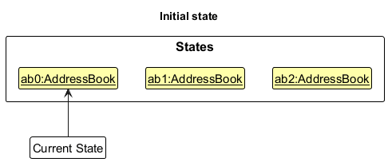

Step 2. The user executes `delete 5` command to delete the 5th person in the address book. The `delete` command calls `Model#commitAddressBook()`, causing the modified state of the address book after the `delete 5` command executes to be saved in the `addressBookStateList`, and the `currentStatePointer` is shifted to the newly inserted address book state.

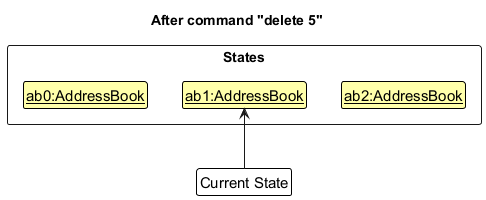

Step 3. The user executes `add n/David …​` to add a new person. The `add` command also calls `Model#commitAddressBook()`, causing another modified address book state to be saved into the `addressBookStateList`.

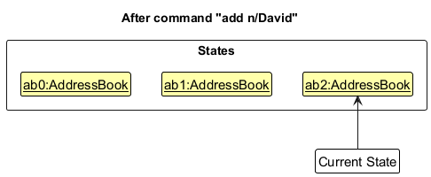

:information_source: **Note:** If a command fails its execution, it will not call `Model#commitAddressBook()`, so the address book state will not be saved into the `addressBookStateList`.

Step 4. The user now decides that adding the person was a mistake, and decides to undo that action by executing the `undo` command. The `undo` command will call `Model#undoAddressBook()`, which will shift the `currentStatePointer` once to the left, pointing it to the previous address book state, and restores the address book to that state.

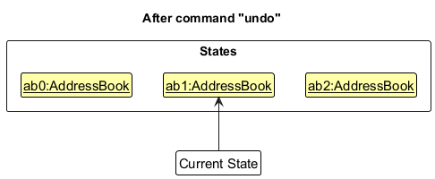

:information_source: **Note:** If the `currentStatePointer` is at index 0, pointing to the initial AddressBook state, then there are no previous AddressBook states to restore. The `undo` command uses `Model#canUndoAddressBook()` to check if this is the case. If so, it will return an error to the user rather
than attempting to perform the undo.

The following sequence diagram shows how an undo operation goes through the `Logic` component:

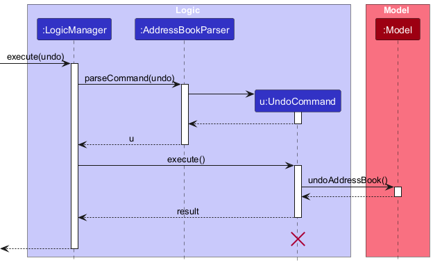

:information_source: **Note:** The lifeline for `UndoCommand` should end at the destroy marker (X) but due to a limitation of PlantUML, the lifeline reaches the end of diagram.

Similarly, how an undo operation goes through the `Model` component is shown below:

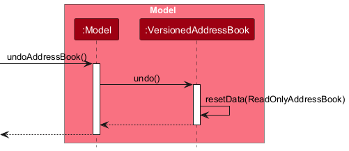

The `redo` command does the opposite — it calls `Model#redoAddressBook()`, which shifts the `currentStatePointer` once to the right, pointing to the previously undone state, and restores the address book to that state.

:information_source: **Note:** If the `currentStatePointer` is at index `addressBookStateList.size() - 1`, pointing to the latest address book state, then there are no undone AddressBook states to restore. The `redo` command uses `Model#canRedoAddressBook()` to check if this is the case. If so, it will return an error to the user rather than attempting to perform the redo.

Step 5. The user then decides to execute the command `list`. Commands that do not modify the address book, such as `list`, will usually not call `Model#commitAddressBook()`, `Model#undoAddressBook()` or `Model#redoAddressBook()`. Thus, the `addressBookStateList` remains unchanged.

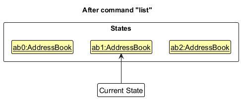

Step 6. The user executes `clear`, which calls `Model#commitAddressBook()`. Since the `currentStatePointer` is not pointing at the end of the `addressBookStateList`, all address book states after the `currentStatePointer` will be purged. Reason: It no longer makes sense to redo the `add n/David …​` command. This is the behavior that most modern desktop applications follow.

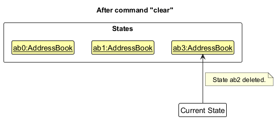

The following activity diagram summarizes what happens when a user executes a new command:

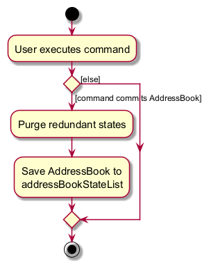

#### Design considerations:

**Aspect: How undo & redo executes:**

* **Alternative 1 (current choice):** Saves the entire address book.
  * Pros: Easy to implement.
  * Cons: May have performance issues in terms of memory usage.

* **Alternative 2:** Individual command knows how to undo/redo by
  itself.
  * Pros: Will use less memory (e.g. for `delete`, just save the person being deleted).
  * Cons: We must ensure that the implementation of each individual command are correct.

_{more aspects and alternatives to be added}_

### \[Proposed\] Data archiving

_{Explain here how the data archiving feature will be implemented}_

--------------------------------------------------------------------------------------------------------------------

## **Documentation, logging, testing, configuration, dev-ops**

* [Documentation guide](Documentation.md)
* [Testing guide](Testing.md)
* [Logging guide](Logging.md)
* [Configuration guide](Configuration.md)
* [DevOps guide](DevOps.md)

--------------------------------------------------------------------------------------------------------------------

## **Appendix: Requirements**

### Product scope

**Target user profile**:

* has a need to manage a significant number of small to medium financial interactions (debts and loans) with various contacts
* prefer using a dedicated desktop application over mobile apps or spreadsheets for financial logging
* can type quickly and prefers keyboard shortcuts/commands over navigating nested menus with a mouse
* prefer keeping financial data stored locally rather than on a cloud-based service
* is reasonably comfortable using CLI applications and appreciates the precision of text-based input

**Value proposition**: streamline debt and loan management by allowing users to record, track, and settle transactions significantly faster than traditional GUI-driven apps or manual ledger entries

### User stories

Priorities: High (must have) - `* * *`, Medium (nice to have) - `* *`, Low (unlikely to have) - `*`

| Priority | As a …​                 | I want to …​                           | So that I can…​                                                        |
|----------|-------------------------|----------------------------------------|------------------------------------------------------------------------|
| `* * *`  | new user                | see usage instructions                 | refer to instructions when I forget how to use the App                 |
| `* * *`  | user                    | add a new person                       | track debts with specific people                                       |
| `* * *`  | user                    | delete a person                        | remove entries that I no longer need                                   |
| `* * *`  | user                    | record money I owe someone             | remember my debts                                                      |
| `* * *`  | user                    | record money someone owes me           | keep track of loans I gave                                             |
| `* * *`  | user                    | list outstanding balances              | quickly see who owes what                                              |
| `* * *`  | user                    | settle a transaction                   | mark debts as paid                                                     |
| `* * *`  | user                    | delete an incorrect entry              | remove mistakes                                                        |
| `* * *`  | user                    | find a person by name                  | locate details of persons without having to go through the entire list |
| `* *`    | user                    | add descriptions to transactions       | remember why the transaction happened                                  |
| `* *`    | user                    | view transaction history with a person | track past financial interactions                                      |
| `* *`    | user                    | hide private contact details           | minimize chance of someone else seeing them by accident                |
| `*`      | user with many contacts | sort persons by name                   | locate a person easily to see their debts and loans                    |
| `*`      | careful user            | undo recent changes                    | recover from mistakes                                                  |

*{More to be added}*

### Use cases

(For all use cases below, the **System** is the `IOU` and the **Actor** is the `user`, unless specified otherwise)

**Use case: Add a person**

**MSS**

1.  User requests to add a person
2.  IOU adds the person

    Use case ends.

**Extensions**

* 2a. The given information for the person is wrong/insufficient

    * 2a1. IOU shows an error message.

      Use case ends.

**Use case: Delete a person**

**MSS**

1.  User requests to list persons
2.  IOU shows a list of persons
3.  User requests to delete a specific person in the list
4.  IOU deletes the person

    Use case ends.

**Extensions**

* 2a. The list is empty.

  Use case ends.

* 3a. The given index is invalid.

    * 3a1. IOU shows an error message.

      Use case resumes at step 2.

**Use Case: Record a debt**

**MSS**

1.  User requests to list persons.
2.  IOU displays the list of persons.
3.  User requests to record a debt using the person index.
4.  IOU records the debt under the selected person.
5.  IOU updates the outstanding balance.

    Use case ends.

**Extensions**

* 4a. Invalid person index.

    * 4a1. IOU displays an error message.

      Use case resumes at step 2.

* 4b. Invalid amount format.

    * 4b1. IOU displays validation error message.

      Use case ends.

**Use Case: Settle a transaction**

**MSS**

1. User requests to list persons.
2. IOU displays the list of persons.
3. User requests to view a particular person.
4. IOU shows the view of the person to the user.
5. User views a person's transaction list.
6. User requests to settle a transaction.
7. IOU records the transaction's current outstanding amount before settling.
8. IOU marks the transaction as settled and sets its outstanding balance to $0.00.
9. IOU displays a success message showing the original amount that was settled, the description, and the parties involved.
10. IOU recalculates the person's balance.
11. IOU updates the UI.
   Use case ends.

Extensions

* 1a. Transaction index invalid.

    * 1a1. IOU displays error message.

    Use case ends.

* 6b. Transaction already settled.

    * 6b1. IOU informs user the transaction is already settled.

    Use case ends.

*{More to be added}*

### Non-Functional Requirements

1.  Should work on any _mainstream OS_ as long as it has Java `17` or above installed.
2.  Should be able to hold up to 1000 persons without a noticeable sluggishness in performance for typical usage.
3.  A user with above average typing speed for regular English text (i.e. not code, not system admin commands) should be able to accomplish most of the tasks faster using commands than using the mouse.
4.  Typical commands should execute within 1 second under normal conditions.
5.  The application should automatically save data after each modifying command to prevent data loss.
6.  The system should store data in a human-readable JSON format.
7.  A user with average typing speed should be able to record transactions faster using commands than mouse interactions.
8.  The application should continue functioning even if optional fields such as phone or email are missing.
9.  The application should provide clear error messages when invalid commands are entered.

*{More to be added}*

### Glossary

* **Mainstream OS**: Windows, Linux, Unix, MacOS
* **Private contact detail**: A contact detail that is not meant to be shared with others
* **Debt**: Money that the user owes another person.
* **Loan**: Money that another person owes the user.
* **Transaction**: A record representing either a debt or a loan between the user and another person.
* **Outstanding Balance**: The total amount currently owed or receivable that has not yet been settled.
* **Person Index**: The numerical position of a person in the current displayed list.
* **Transaction Index**: The position of a transaction within a person’s transaction history.

--------------------------------------------------------------------------------------------------------------------

## **Appendix: Instructions for manual testing**

Given below are instructions to test the app manually.

:information_source: **Note:** These instructions only provide a starting point for testers to work on;
testers are expected to do more *exploratory* testing.

### Launch and shutdown

1. Initial launch

   1. Download the jar file and copy into an empty folder

   1. Double-click the jar file Expected: Shows the GUI with a set of sample contacts. The window size may not be optimum.

1. Saving window preferences

   1. Resize the window to an optimum size. Move the window to a different location. Close the window.

   1. Re-launch the app by double-clicking the jar file. 
       Expected: The most recent window size and location is retained.

1. _{ more test cases …​ }_

### Deleting a person

1. Deleting a person while all persons are being shown

   1. Prerequisites: List all persons using the `list` command. Multiple persons in the list.

   1. Test case: `delete 1` 
      Expected: First contact is deleted from the list. Details of the deleted contact shown in the status message. Timestamp in the status bar is updated.

   1. Test case: `delete 0` 
      Expected: No person is deleted. Error details shown in the status message. Status bar remains the same.

   1. Other incorrect delete commands to try: `delete`, `delete x`, `...` (where x is larger than the list size) 
      Expected: Similar to previous.

1. _{ more test cases …​ }_

### Adding a Transaction

1. Adding a transaction while all persons are being shown

    1. Prerequisites: List all persons using the `list` command. Multiple persons (at least 2) in the list.

    1. Test case: `addtxn 1 2 a/50 d/dinner` 
       Expected: A transaction is added from person 1 to person 2 for an amount of 50 with no interest and no compounding type. Details of the added transaction shown in the status message. Timestamp in the status bar is updated.

    1. Test case: `addtxn 1 2 a/50` 
       Expected: No transaction is added. Error details shown in the status message indicating that the description cannot be empty. Status bar remains the same.

    1. Test case: `addtxn 0 2 a/50` 
       Expected: No transaction is added. Error details shown in the status message indicating invalid index. Status bar remains the same.

    1. Test case: `addtxn 1 1 a/50` 
       Expected: No transaction is added. Error details shown in the status message indicating debtor and creditor cannot be the same person. Status bar remains the same.

    1. Test case: `addtxn 1 2 a/-50` 
       Expected: No transaction is added. Error details shown in the status message indicating amount must be a positive value. Status bar remains the same.
   
    1. Other incorrect `addtxn` commands to try: `addtxn`, `addtxn 1 2`, `addtxn 1 2 a/50`, `addtxn x 2 a/50 i/5` (where x is larger than the list size) 
       Expected: Similar to previous. Error details shown in the status message. Status bar remains the same.

    1. _{ more test cases … }_

### Saving data

1. Dealing with missing/corrupted data files

   1. Delete `data/addressbook.json` and `data/addressbook_transactions.json`, then start the app. 
      Expected: The app recreates the data files from sample data and inserts the default `Me` contact if needed.

   1. Corrupt either JSON file by introducing invalid JSON syntax, then start the app. 
      Expected: The app logs a data loading warning and starts with an empty address book instead of partially loading corrupted data.

1. _{ more test cases …​ }_
