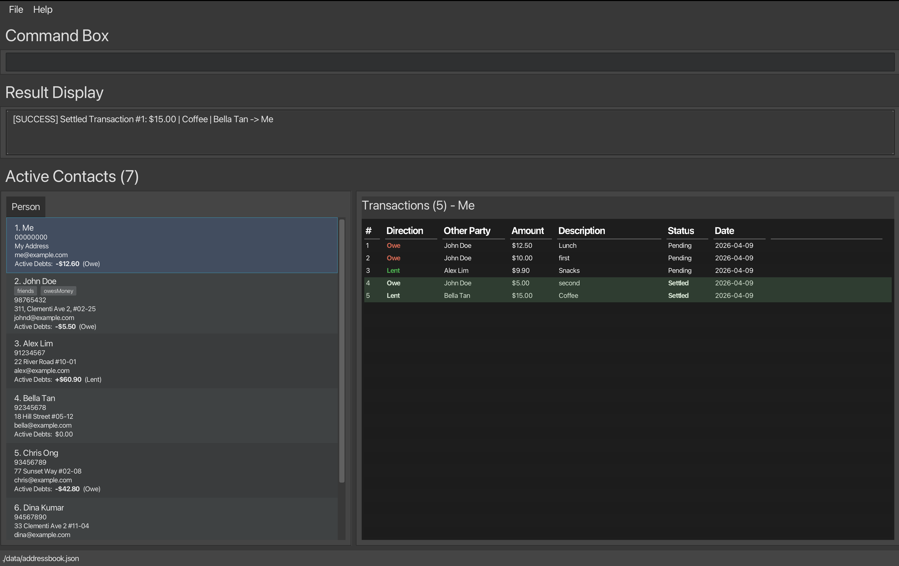

# About IOU

## What is IOU?
IOU is a desktop application designed to help you keep track of small debts and loans between friends, colleagues, or roommates. Prefer typing over clicking? You’ll feel right at home here. Commands let you work fast, while the interface keeps everything visible and organized.

By using simple text commands instead of spreadsheets or mobile apps, IOU allows users to log financial transactions directly from their laptops in seconds. It’s ideal for staying on top of peer-to-peer debts during workdays, social events, or shared living situations.

## Why is this app needed?
Managing multiple small debts can be tedious and error-prone, especially when relying on spreadsheets or phone apps. These tools can be slow, disruptive, or hard to reference quickly.

IOU provides a keyboard-friendly, streamlined solution that lets users record, check, and update financial records instantly—saving time, reducing mistakes, and keeping your personal finances organized.

## Who are the target users?
IOU is especially suited for people who:
* Spend most of their day on a laptop or desktop
* Handle multiple informal loans or shared expenses
* Prefer typing commands over navigating menus or clicking buttons
* Want fast, clear, and organized access to personal finance records

## What value does IOU provide?
With IOU, users can:
* Quickly record new debts and loans
* Track outstanding balances at a glance
* Keep financial records accurate and up-to-date
* Replace cluttered spreadsheets with a smooth, efficient workflow


* Table of Contents
{:toc}

--------------------------------------------------------------------------------------------------------------------

## Quick start

1. Ensure you have Java `17` or above installed in your Computer.<br>
   **Mac users:** Ensure you have the precise JDK version prescribed [here](https://se-education.org/guides/tutorials/javaInstallationMac.html).

1. Download the latest `.jar` file from the [Releases page](https://github.com/AY2526S2-CS2103T-T16-2/tp/releases).

1. Copy the file to the folder you want to use as the _home folder_ for IOU.

1. Open a command terminal, `cd` into the folder you put the jar file in, and use the `java -jar iou.jar` command to run the application.<br>
   A GUI similar to the below should appear in a few seconds. Note how the app contains some sample data.<br>
   If no person named `Me` exists yet, IOU inserts a default `Me` person at the top of the list on startup.<br>

   

1. Type the command in the command box and press Enter to execute it. e.g. typing **`help`** and pressing Enter will open the help window.<br>
   Some example commands you can try:

   * `list` : Lists all entries.

   * `add n/John Doe p/98765432 e/johnd@example.com a/John street, block 123, #01-01` : Adds a person named `John Doe` to IOU.

   * `delete 3` : Deletes the 3rd entry shown in the current list.

   * `clear` : Deletes all entries.

   * `exit` : Exits the app.

1. Refer to the [Features](#features) below for details of each command.

--------------------------------------------------------------------------------------------------------------------

## Features

<div markdown="block" class="alert alert-info">

**:information_source: Notes about the command format:**<br>

* Words in `UPPER_CASE` are the parameters to be supplied by the user.<br>
  e.g. in `add n/NAME`, `NAME` is a parameter which can be used as `add n/John Doe`.

* Items in square brackets are optional.<br>
  e.g `n/NAME [t/TAG]` can be used as `n/John Doe t/friend` or as `n/John Doe`.

* Items with `…`​ after them can be used multiple times including zero times.<br>
  e.g. `[t/TAG]…​` can be used as ` ` (i.e. 0 times), `t/friend`, `t/friend t/family` etc.

* Parameters can be in any order.<br>
  e.g. if the command specifies `n/NAME p/PHONE_NUMBER`, `p/PHONE_NUMBER n/NAME` is also acceptable.

* Extraneous parameters for commands that do not take in parameters (such as `help`, `list`, `exit` and `clear`) will be ignored.<br>
  e.g. if the command specifies `help 123`, it will be interpreted as `help`.

* Select a person in the person list to view that person's transactions in the transaction panel.

* For commands that target a transaction using `t/TRANSACTION_INDEX`, the transaction index refers to the order shown in the transaction panel, sorted from the largest current amount to the smallest.

* If you are using a PDF version of this document, be careful when copying and pasting commands that span multiple lines as space characters surrounding line-breaks may be omitted when copied over to the application.
</div>

### View help : `help`

Shows a message explaining how to access the help page.


Format: `help`


### Add a person: `add`

Adds a person to the address book.

Format: `add n/NAME p/PHONE_NUMBER e/EMAIL a/ADDRESS [t/TAG]…​`

<div markdown="span" class="alert alert-primary">:bulb: **Tip:**
A person can have any number of tags (including 0)
</div>

Examples:
* `add n/John Doe p/98765432 e/johnd@example.com a/John street, block 123, #01-01`
* `add n/Betsy Crowe t/friend e/betsycrowe@example.com a/Newgate Prison p/1234567 t/criminal`

### List all persons : `list`

Shows a list of all persons in the address book.

Format: `list`

### Edit a person : `edit`

Edits an existing person in the address book.

Format: `edit INDEX [n/NAME] [p/PHONE] [e/EMAIL] [a/ADDRESS] [t/TAG]…​`

* Edits the person at the specified `INDEX`. The index refers to the index number shown in the displayed person list. The index **must be a positive integer** 1, 2, 3, …​
* At least one of the optional fields must be provided.
* Existing values will be updated to the input values.
* When editing tags, the existing tags of the person will be removed i.e adding of tags is not cumulative.
* You can remove all the person’s tags by typing `t/` without
    specifying any tags after it.

Examples:
*  `edit 1 p/91234567 e/johndoe@example.com` Edits the phone number and email address of the 1st person to be `91234567` and `johndoe@example.com` respectively.
*  `edit 2 n/Betsy Crower t/` Edits the name of the 2nd person to be `Betsy Crower` and clears all existing tags.

### Advanced Search: `find`

The `find` command has been significantly enhanced to support multi-criteria filtering, allowing you to search for persons using various attributes including names, transaction details, amounts, and tags. This powerful feature lets you quickly locate specific records in your address book using flexible filter combinations.

Format: `find [n/NAME] [d/DESCRIPTION] [min/MIN_AMOUNT] [max/MAX_AMOUNT] [t/TAG]`

<div markdown="span" class="alert alert-primary">**Key Principles:**
* All filters are **optional**, but you must provide at least one
* All provided filters use **AND logic** - persons must match ALL specified criteria
* Search is **case-insensitive** for all text-based filters
* Partial matches are supported for name, description, and tag filters
</div>

#### Filter Types

**1. Name Filter (`n/`)**
* Searches within person names using partial, case-insensitive matching
* Matches any part of the full name (first name, last name, or both)
* Example: `n/alex` will match "Alex", "Alexander", "Alexandra", "Alex Tan"

**2. Description Filter (`d/`)**
* Searches within transaction descriptions
* Matches if ANY transaction of the person contains the keyword
* Case-insensitive partial matching
* Example: `d/lunch` will match transactions with descriptions like "Team lunch", "lunch meeting", "LUNCH"

**3. Minimum Amount Filter (`min/`)**
* Finds persons who have at least one transaction with amount ≥ the specified value
* Must be a positive number (decimals allowed)
* Example: `min/50` finds persons with at least one transaction of $50 or more

**4. Maximum Amount Filter (`max/`)**
* Finds persons who have at least one transaction with amount ≤ the specified value
* Must be a positive number (decimals allowed)
* Example: `max/100` finds persons with at least one transaction of $100 or less

**5. Tag Filter (`t/`)**
* Searches for persons with specific tags
* Case-insensitive partial matching on tag names
* Example: `t/friend` will match tags like "friend", "friends", "best-friend"


#### Single Filter Examples

**Finding by name:**
* `find n/John` - Returns all persons with "John" in their name
    * Matches: "John Doe", "Johnny Tan", "Mary Johnson"
* `find n/tan` - Returns persons with "tan" anywhere in their name
    * Matches: "Alex Tan", "Stanley Wong", "Tanisha Kumar"

**Finding by transaction description:**
* `find d/dinner` - Returns persons with any transaction containing "dinner"
    * Useful for tracking who you've had dinner expenses with
* `find d/project` - Returns persons with "project" in any transaction
    * Helpful for identifying work-related transactions

**Finding by amount:**
* `find min/100` - Returns persons who owe you or you owe at least $100
    * Useful for identifying large outstanding debts
* `find max/20` - Returns persons with small transactions under $20
    * Helpful for settling minor debts quickly

**Finding by tag:**
* `find t/colleague` - Returns all persons tagged as colleagues
* `find t/vip` - Returns persons with VIP tags

#### Multi-Filter Examples (Advanced Usage)

The real power of the `find` command comes from combining multiple filters. All specified filters must match for a person to appear in the results.

**Example 1: Finding high-value transactions with friends**
* `find t/friend min/100`
* Returns friends who have at least one transaction of $100 or more
* Use case: Quickly identify which friends have significant outstanding amounts

**Example 2: Finding lunch expenses within budget**
* `find d/lunch min/10 max/30`
* Returns persons with lunch transactions between $10 and $30
* Use case: Review typical lunch expense patterns

**Example 3: Locating specific person with transaction details**
* `find n/alex d/dinner min/40`
* Returns persons named "Alex" who have dinner transactions of at least $40
* Use case: Finding a specific transaction you vaguely remember

**Example 4: Finding colleagues with small outstanding amounts**
* `find t/colleague max/25`
* Returns colleagues with transactions under $25
* Use case: Identify easy-to-settle work-related debts

**Example 5: Complex search for trip expenses**
* `find d/trip min/200 max/500 t/friend`
* Returns friends with trip-related transactions between $200 and $500
* Use case: Reviewing shared vacation expenses

#### Tips for Effective Searching

1. **Start broad, then narrow**: Begin with a single filter, then add more criteria if you get too many results
    * First: `find d/dinner`
    * Then refine: `find d/dinner min/50`

2. **Use amount ranges for budgeting**: Set min/max to find transactions in specific price brackets
    * Small debts to settle quickly: `find max/20`
    * Large debts to prioritize: `find min/100`

3. **Combine tags with amounts**: Filter by relationship and transaction size
    * `find t/family min/50` - Family members with larger debts
    * `find t/colleague max/30` - Small work-related expenses

4. **Search descriptions for categories**: Use consistent keywords in descriptions, then search them
    * All groceries: `find d/groceries`
    * All transport: `find d/grab` or `find d/taxi`

5. **Remember partial matching**: You don't need exact words
    * `find n/alex` works for "Alex", "Alexander", "Alexandra"
    * `find d/din` works for "dinner", "dining"

#### Common Search Scenarios

| Scenario | Command | What it finds |
|----------|---------|--------------|
| All persons named John | `find n/john` | Anyone with "john" in their name |
| Friends with big debts | `find t/friend min/100` | Friends with transactions ≥ $100 |
| Small lunch expenses | `find d/lunch max/15` | Lunch transactions ≤ $15 |
| Colleagues owing moderate amounts | `find t/colleague min/20 max/100` | Colleagues with transactions $20-$100 |
| Recent dinner with Alex | `find n/alex d/dinner` | Alex's dinner transactions |
| Trip expenses in range | `find d/trip min/150 max/400` | Trip transactions $150-$400 |

#### Error Messages

* `At least one filter must be provided` - You called `find` without any parameters
* `Minimum amount cannot be greater than maximum amount` - Your min/ value exceeds max/ value
* `Amount values for min/ and max/ must be positive numbers` - You entered invalid numbers
* Duplicate prefix errors - You used the same prefix multiple times (e.g., `find n/alex n/john`)

<div markdown="span" class="alert alert-info"> **Note:**
After using `find` to filter the list, the displayed indices change to match the filtered view. Any subsequent commands (like `delete`, `settle`, `addtxn`) will operate on these filtered indices, not the original positions.
</div>

#### Quick Reference

```
find n/NAME              # Search by name
find d/DESCRIPTION       # Search by transaction description  
find min/AMOUNT          # Transactions at least AMOUNT
find max/AMOUNT          # Transactions at most AMOUNT
find t/TAG               # Search by tag
find n/NAME t/TAG        # Combine filters (AND logic)
find min/X max/Y         # Amount range [X, Y]
find d/DESC min/X max/Y  # Description with amount range
```

### Deleting a person or transaction : `delete`

Removes a specific person or transaction from the records. This command has two modes: deleting entire persons or deleting individual transactions.

**Person Deletion Format:** `delete INDEX`  
**Transaction Deletion Format:** `delete INDEX t/TRANSACTION_INDEX`

* The index refers to the index number shown in the displayed person list.
* The transaction index refers to the displayed transaction panel for that selected person.
* The index **must be a positive integer** 1, 2, 3, …​
* The special **Me** contact (always added at the front) cannot be deleted.
* **Deletion is permanent** - cannot be undone.

<div markdown="span" class="alert alert-warning"> **Warning:**
Deletion is permanent! Consider using `settle` instead of `delete` for paid transactions to preserve your financial history. Only delete for mistakes or invalid entries.
</div>

#### Person Deletion

**Deleting a person removes:**
- ✅ The person from the person list
- ✅ All their transactions (from their view AND counterparties' views)
- ✅ All references to them in other people's transaction panels
- ❌ Cannot delete the "Me" contact (protected)

**Examples:**
* `list` followed by `delete 2` deletes the 2nd person in the address book.
* `find Betsy` followed by `delete 1` deletes the 1st person in the results of the `find` command.

**Effect:** When you delete a person, all transactions involving them are automatically removed from all other persons' transaction panels. This prevents dangling references.

#### Transaction Deletion

**Deleting a transaction removes:**
- ✅ The transaction from BOTH the debtor and creditor
- ✅ The shared transaction record
- ✅ Updates balances for both parties
- ⚠️ Permanently lost - cannot be recovered

**Example:** `delete 1 t/2` deletes transaction #2 from person 1's panel (and from their counterparty's panel too).

<div markdown="span" class="alert alert-primary"> **Transactions are Shared:**
A single transaction appears in both the debtor's and creditor's transaction panels. Deleting it from either person's view removes it completely from both sides.
</div>

#### Common Use Cases:

**Removing duplicate entries:**
```
delete 6  # Remove duplicate person
```

**Fixing mistaken transaction:**
```
delete 2 t/3          # Remove wrong transaction
addtxn 1 2 a/50 d/correct  # Add correct transaction
```

**Cleaning up inactive contacts:**
```
find t/inactive     # Find inactive contacts
delete 1        # Delete them
```

<div markdown="span" class="alert alert-info"> **Note:**
After deleting a person from a filtered list, the list refreshes. Transaction indexes may shift after deletion - always re-check the transaction panel if deleting multiple transactions.
</div>

### Adding a transaction : `addtxn`

Adds a transaction between two persons in the address book.

Format: `addtxn DEBTOR_INDEX CREDITOR_INDEX a/AMOUNT d/DESCRIPTION`

* Adds a transaction from the debtor to the creditor at the specified indexes.
* The indexes refer to the index numbers shown in the displayed person list.
* Both indexes **must be positive integers** 1, 2, 3, …
* Both indexes **must be different** (a person cannot transact with themselves).
* `AMOUNT` must be a positive number.
* `DESCRIPTION` must be provided and cannot be empty.
* The transaction appears in the transaction panel for both people involved.

Examples:
* `addtxn 1 2 a/50 d/lunch` adds a transaction where person 1 owes person 2 $50 for lunch.
* `addtxn 2 3 a/10 d/lunch` adds a transaction where person 2 owes person 3 $10 for lunch.
* `addtxn 1 2 a/100 d/groceries` adds a transaction where person 1 owes person 2 $100 for groceries.

#### Common Scenarios:

**Scenario 1: Recording a shared meal expense**
```
Situation: You (index 1) and Alex (index 2) had dinner. Alex paid the $80 bill.
Command: addtxn 1 2 a/80 d/Dinner at Italian Restaurant
Result: Records that you owe Alex $80 for dinner
```

**Scenario 2: Lending money to a friend**
```
Situation: Your friend Sarah (index 3) borrowed $200 from you (index 1).
Command: addtxn 3 1 a/200 d/Personal loan
Result: Records that Sarah owes you $200
```

**Scenario 3: Splitting group purchases**
```
Situation: You bought concert tickets for $150 each. Your friend Bob (index 4) needs to pay you back.
Command: addtxn 4 1 a/150 d/Concert tickets - Taylor Swift
Result: Records that Bob owes you $150 for tickets
```

**Scenario 4: Roommate shared expenses**
```
Situation: Your roommate (index 2) paid the $120 electricity bill that you split.
Command: addtxn 1 2 a/60 d/Electricity bill - January
Result: Records your half of the shared utility bill
```

#### Multiple Transactions to Same Person:

You can record multiple separate transactions between the same two people. Each transaction is tracked independently:

```
addtxn 1 2 a/25 d/Lunch Monday
addtxn 1 2 a/30 d/Dinner Tuesday  
addtxn 1 2 a/15 d/Coffee Wednesday
```

This creates three separate transaction records between persons 1 and 2, allowing you to track each expense individually before settling.

#### Amount Formatting Rules:

* **Valid amounts:** `50`, `50.5`, `50.50`, `0.01`
* **Invalid amounts:** `$50` (no currency symbols), `50.` (must have 2 decimals or none), `50.505` (max 2 decimals)
* **Minimum amount:** Must be greater than 0
* **Maximum decimals:** 2 places

#### Description Best Practices:

While descriptions are optional, adding them makes your transaction history much more useful:

* **Be specific:** "Dinner at Fish Market" instead of just "dinner"
* **Include dates for recurring expenses:** "Rent - January 2026"
* **Note the occasion:** "Birthday gift", "Concert tickets - Taylor Swift"
* **Reference project names:** "Project Alpha - Office Supplies"

This helps when you later search using `find d/` or review transaction history.

#### Transaction Numbering:

When you add a transaction, IOU automatically assigns it a transaction number showing the total count of transactions between those two people:

```
New transaction added (#3): Alice owes Bob - $25.00 - Coffee
```

This number helps you track how many separate transactions exist between any two people.

#### Error Messages and Solutions:

| Error | Cause | Solution |
|-------|-------|----------|
| "Debtor and creditor cannot be the same person" | Both indexes are identical | Use different person indexes |
| "The debtor index provided is invalid" | Debtor index out of range | Check person list and use valid index |
| "The creditor index provided is invalid" | Creditor index out of range | Check person list and use valid index |
| "Amount must be a positive number" | Amount is 0 or negative | Use positive amount > 0 |
| Invalid command format | Missing required parameters | Include both indexes and a/ prefix |

<div markdown="span" class="alert alert-info"> **Note:**
After adding a transaction, both persons will show the transaction in their transaction panel. The transaction is shared between them - modifying or settling it from either person's view affects both sides.
</div>

#### Tips for Managing Transactions:

1. **Add transactions promptly** - Record expenses as they happen to avoid forgetting details
2. **Use consistent descriptions** - This makes searching with `find d/` more effective
3. **Review before settling** - Select a person to view all their transactions before settling
4. **Track categories** - Use description keywords like "meal", "transport", "bills" for easy filtering

#### Related Commands:

* `settle INDEX t/TRANS_INDEX` - Mark a single transaction as paid
* `settleup INDEX1 INDEX2 INDEX3...` - Settle all transactions in a group
* `delete INDEX t/TRANS_INDEX` - Remove a transaction entirely
* `find d/DESCRIPTION` - Search for transactions by description

### Clearing all entries : `clear`

Clears all entries from the address book.

Format: `clear`

### Settling a transaction : `settle`

Marks a specific transaction as paid while keeping it in the history so the outstanding balance for the person is recalculated without losing the record.

Format: `settle PERSON_INDEX t/TRANSACTION_INDEX`

* The person index refers to the displayed person list.
* The transaction index refers to the displayed transaction panel for that selected person.
* Settling marks the transaction as `Settled`, but keeps the record visible in the transaction history.
* Active debts amount is updated.
* The success message displays the original amount that was settled (e.g. Settled Transaction #1: $50.00 | lunch | Alice → Bob), 
so you always have a clear record of what was paid.
* **Settled transactions cannot be unsettled** - the change is permanent.

<div markdown="span" class="alert alert-primary">**Why Keep Settled Transactions:**
Unlike deleting, settling preserves your complete financial history. You can always review what was paid, when, and to whom. This is valuable for budgeting, tax purposes, or simply remembering past shared expenses.
</div>

#### How to Settle a Transaction:

**Step 1:** Select the person in the person list (left panel)
- Their transactions appear in the transaction panel (right panel)
- Transactions are sorted by amount (largest first)

**Step 2:** Find the transaction index
- Transactions are numbered 1, 2, 3, ... in the transaction panel
- Note the index of the transaction you want to settle

**Step 3:** Execute the settle command
```
settle PERSON_INDEX t/TRANSACTION_INDEX
```

**Example: Settling a lunch debt**
```
Situation: You owe Alex (person 1) $25 for lunch. This is transaction #2 in Me panel.
Command: settle 1 t/2
 
Result:
Settled Transaction #2: $25.00 | lunch | You -> Alex
Transaction remains visible but marked "Settled" with $0.00 balance
```
#### What Happens When You Settle:

Before settling:
```
Transaction: $25.00 | Lunch at Italian Restaurant | You -> Alex
Status: Unsettled
Active Debts: $-50.00(Owe)
```

After settling:
```
Transaction: Settled | Lunch at Italian Restaurant | You -> Alex  
Status: Settled
Active Debts: $0.00
Original Amount: $50.00 (preserved in history)
```

The transaction:
- ✅ Remains visible in transaction history
- ✅ Shows as "Settled" status
- ✅ Active Debts becomes $0.00
- ✅ Original amount preserved for reference
- ✅ Description and parties preserved
- ✅ Both debtor and creditor see it as settled

#### Already Settled Transactions:

If you try to settle a transaction that's already settled:

```
Command: settle 1 t/2
 
Result:
This transaction has already been settled.
```

You cannot settle a transaction twice. Check the transaction panel to see which transactions still need settling.

#### Error Messages:

| Error | Cause | Solution |
|-------|-------|----------|
| "This transaction has already been settled" | Transaction already marked settled | Check transaction panel, only settle unsettled ones |
| "No transactions found for [Person]" | Person has no transactions | Add transactions first before settling |
| "The transaction index provided is invalid" | Transaction index out of range | Check transaction panel for valid indexes |
| Invalid person index | Person index out of range | Use valid person index from person list |

#### Tips for Effective Settlement:

1. **Settle promptly after payment** - Mark transactions settled as soon as money changes hands
   ```
   Payment received → settle immediately
   ```

2. **Verify before settling** - Make sure the payment actually cleared
   ```
   Bank transfer pending → Wait
   Cash received → Settle immediately
   ```

3. **Check the person's panel first** - Always view transactions before settling
   ```
   Click person → View panel → Note index → settle
   ```

4. **Use find before settling** - Filter to specific transactions
   ```
   find d/january → View January transactions → Settle them
   ```

#### Viewing Settled Transaction History:

After settling, you can still view the transaction:
- Select the person in the person list
- Scroll to see settled transactions (usually at bottom or separate section)
- View original amount, description, and date
- Use for budgeting, tax records, or expense tracking

### Simplifying debts among a group : `simplify`

Computes a minimal settlement plan for 3 or more selected people and shows who should pay whom, without modifying any transactions yet.

Format: `simplify PERSON_INDEX [MORE_PERSON_INDEXES]...`

* You must provide at least 3 distinct person indexes.
* All indexes refer to the currently displayed person list.
* Only unsettled transactions between selected people are included in the calculation.
* The command is preview-only: it does not mark any transaction as settled.
* The resulting plan is shown in the UI result display.

Examples:
* `simplify 1 2 3`
* `simplify 1 2 3 4`

### Settling up a group : `settleup`

Marks all unsettled in-group transactions as settled in one action for 3 or more selected people.

Format: `settleup PERSON_INDEX [MORE_PERSON_INDEXES]...`

* You must provide at least 3 distinct person indexes.
* All indexes refer to the currently displayed person list.
* Only transactions where **both** the debtor and the creditor are in the selected group are settled.
* Transactions involving anyone outside the group are left unchanged.
* The result display shows how many transactions were settled and the total amount.

Examples:
* `settleup 1 2 3`
* `settleup 1 2 3 4 5`

### Deleting a transaction : `delete`

Removes a specific transaction from a person; specifying both the person index and transaction index lets you target the exact entry.

Format: `delete INDEX t/TRANSACTION_INDEX`

* The person index refers to the displayed person list.
* The transaction index refers to the displayed transaction panel for that selected person.
* Deleting a transaction removes the same shared record from both the debtor and the creditor.

Example: `delete 1 t/2`

### Exiting the program : `exit`

Exits the program.

Format: `exit`

### Saving the data

IOU saves data to disk automatically after any command that changes the data. There is no need to save manually.

Person data is stored in `[JAR file location]/data/addressbook.json`.
Transaction data is stored in `[JAR file location]/data/addressbook_transactions.json`.

### Editing the data file

Advanced users can edit the JSON files directly.

* `[JAR file location]/data/addressbook.json` stores persons.
* `[JAR file location]/data/addressbook_transactions.json` stores transactions.
* If you edit transactions manually, debtor and creditor entries must still match valid persons in the address book.

<div markdown="span" class="alert alert-warning">:exclamation: **Caution:**
If your changes make either file invalid, IOU may fail to load your saved data correctly at the next run. Hence, it is recommended to take a backup of both files before editing them.<br>
Furthermore, certain edits can cause IOU to behave in unexpected ways if person and transaction records no longer match. Therefore, edit the data files only if you are confident that you can update them correctly.
</div>


--------------------------------------------------------------------------------------------------------------------

## FAQ

**Q**: How do I transfer my data to another Computer?<br>
**A**: Install the app on the other computer and overwrite the empty data file it creates with the file that contains the data from your previous IOU home folder.

--------------------------------------------------------------------------------------------------------------------

## Known issues

1. **When using multiple screens**, if you move the application to a secondary screen, and later switch to using only the primary screen, the GUI will open off-screen. The remedy is to delete the `preferences.json` file created by the application before running the application again.

--------------------------------------------------------------------------------------------------------------------

## Command summary

Action | Format, Examples
--------|------------------
**Add** | `add n/NAME p/PHONE_NUMBER e/EMAIL a/ADDRESS [t/TAG]…​` <br> e.g., `add n/James Ho p/22224444 e/jamesho@example.com a/123, Clementi Rd, 1234665 t/friend t/colleague`
**Add Transaction** | `addtxn DEBTOR_INDEX CREDITOR_INDEX a/AMOUNT d/DESCRIPTION`<br> e.g., `addtxn 1 2 a/12.50 d/Dinner at Fish Market`
**Clear** | `clear`
**Delete** | `delete INDEX`<br> e.g., `delete 3`
**Edit** | `edit INDEX [n/NAME] [p/PHONE_NUMBER] [e/EMAIL] [a/ADDRESS] [t/TAG]…​`<br> e.g.,`edit 2 n/James Lee e/jameslee@example.com`
**Find** | `find KEYWORD [MORE_KEYWORDS]`<br> e.g., `find James Jake`
**List** | `list`
**Settle** | `settle PERSON_INDEX t/TRANSACTION_INDEX`<br> e.g., `settle 1 t/2`
**Simplify** | `simplify PERSON_INDEX [MORE_PERSON_INDEXES]...`<br> e.g., `simplify 1 2 3 4`
**Settle Up** | `settleup PERSON_INDEX [MORE_PERSON_INDEXES]...`<br> e.g., `settleup 1 2 3 4`
**Help** | `help`
